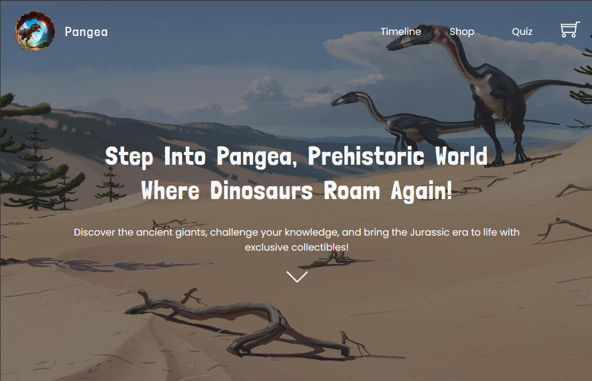
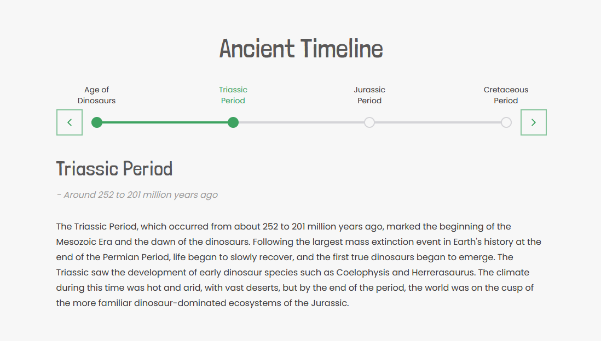
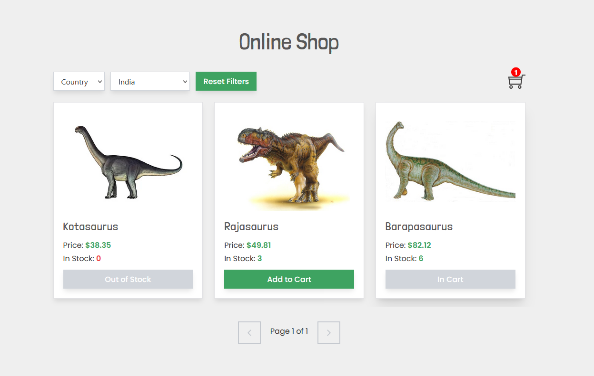
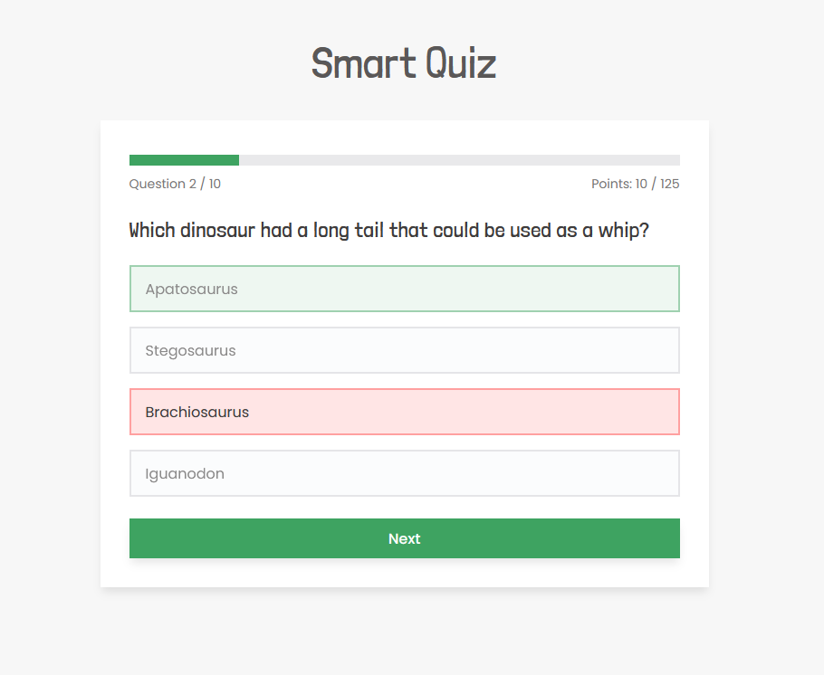
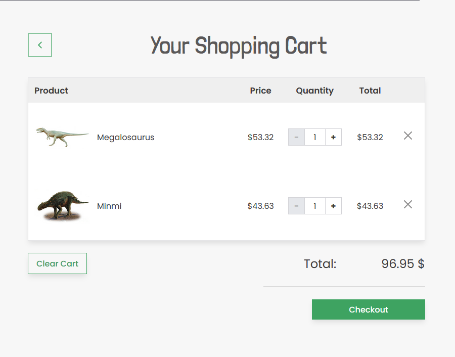
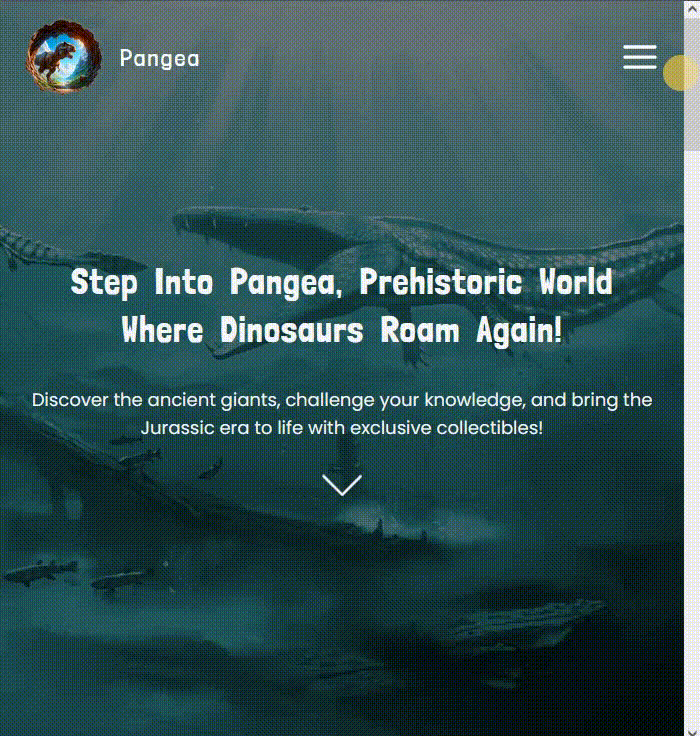

# Pangea

# 🔗 [Live preview](https://pangea-dino-museum.netlify.app/)

# ▶️ [Video walkthrough by dev](https://youtu.be/FCIJ71fVwIc?feature=shared)

---

## Table of Contents

- [About Project](#about-project)
- [Features](#features)
- [How it works](#how-it-works)
- [Technologies & Dependencies used](#technologies--dependencies-used)
- [Prerequisites](#prerequisites)
- [Clone & Run locally](#clone--run-locally)
- [Team](#team)
- [Special Thanks](#special-thanks)
- [Contributing](#contributing)

---

## About Project

Pangea is a platform that educates and entertains adults who love dinosaurs. This app combines educational content, interactive features, and e-commerce functionality to provide a comprehensive and engaging experience for dinosaur enthusiasts.

It is a full stack applications, using React as primary frontend language, and NodeJS/Express as primary backend language. MongoDB is used for database. To learn more, visit _Technologies & Dependencies used_ section further down or refer to readme file inside **backend**.

---

## Features

- **Timeline:** An interactive timeline that provides a historical overview of the different periods when dinosaurs roamed the Earth, including the Triassic, Jurassic, and Cretaceous periods.

- **Ecommerce:** Small scale online shop where users can browse dinosaur-themed merchandise. The shop features a search options, filter options, and a shopping cart for managing purchases.

- **Quiz:** A fun and educational quiz that tests users' knowledge about dinosaurs, with questions ranging from dinosaur names to their characteristics and historical facts.

- **Shopping Cart and Checkout:** Shopping Cart that allows users to add, remove, and update the quantity of items.

---

## How it works

The Pangea app is built using React for the frontend, with Redux Toolkit for state management. MongoDB for database needs and Express.js for backend services. Here's a detailed explanation of how each section works:

- **Timeline:**

The Timeline component is using map method to map over local data to present information about different time periods to the user upon left/right button click.

- **Ecommerce:**

The Ecommerce component fetches the data from the Mongo database using an API. Both database and the backend API were custom made specifically for this project. The database is scaled down from information about around 300 dinosaurs to 65. The backup copy of the database is stored in a json file in the backend folder named _mongoDBbackup.json_.

- **Quiz:**

The Quiz component is mapping over local data in _utils/data.js_ to display questions. depending on whether the correct/wrong question is selected, a different styling will be applied. The quiz will keep your personal high score and award you different emojis based on points gained.

- **Shopping Cart and Checkout:**

The Shopping Cart component allows users to manage their selected items, including updating quantities and removing items.
Cart state is saved in local storage, allowing users to resume their shopping session even after closing the browser.

---

## Technologies & Dependencies used

- **React:** for all the logic, many React features were used: conditionals, components, useState, useEffect, functions...

- **Redux Toolkit:** for global state management.

- **React Icons:** for all the icons in the app.

- **Framer motion:** for animations

- **React Router:** for all routing needs.

- **Tailwind:** for all styling, dark mode, custom classes...

- **MongoDB:** for storing JSON type information about the dinosaurs that are fetched and displayed in the UI

 

**dependencies:**

- "@reduxjs/toolkit": "^2.5.0",
- "framer-motion": "^11.17.0",
- "react": "^18.3.1",
- "react-dom": "^18.3.1",
- "react-icons": "^5.4.0",
- "react-redux": "^9.2.0",
- "react-router-dom": "^7.1.3",
- "react-toastify": "^11.0.3"

**devDependencies:**

- "@eslint/js": "^9.17.0",
- "@types/react": "^18.3.18",
- "@types/react-dom": "^18.3.5",
- "@vitejs/plugin-react": "^4.3.4",
- "autoprefixer": "^10.4.20",
- "eslint": "^9.17.0",
- "eslint-plugin-react": "^7.37.2",
- "eslint-plugin-react-hooks": "^5.0.0",
- "eslint-plugin-react-refresh": "^0.4.16",
- "globals": "^15.14.0",
- "postcss": "^8.4.49",
- "prettier": "^3.5.3",
- "prettier-plugin-tailwindcss": "^0.6.11",
- "tailwindcss": "^3.4.17",
- "vite": "^6.0.5"

---

## Prerequisites

Ensure you have the following installed on your system:

    Node.js v18.00.0
    npm or yarn

---

## Clone & Run locally

1. **Clone the Repository:**

   - On the GitHub repo page, click the green "Code" button.

   - Copy the HTTPS URL.

2. **Open the Terminal:**

   - Open the terminal by typing "cmd" in your desktop's start menu, **OR**

   - Right-click on the desktop and select "Git Bash Here" (if you have Git Bash installed), **OR**

   - Open Visual Studio Code's terminal by clicking "Terminal" -> "New Terminal" inside the editor.

3. **Navigate to Your Project Location:**

   - In the terminal, navigate to your desired location (e.g., desktop) using the command: `cd desktop`. Adjust the path if your project is located elsewhere.

   - Ensure that your terminal's address is inside the project folder.

4. **Clone the Repository:**

   - Run the command: `git clone /link/`. Replace `/link/` with the HTTPS URL from step 1.

5. **Enter the Project Directory:**

   - Navigate into the cloned repository by typing: `cd /folder-name/`. Replace `/folder-name/` with the name of the cloned folder. Then `cd frontend`.

6. **Install Dependencies:**

   - Run the command: `npm install` to install all the necessary dependencies.

7. **Start the Project:**

   - Run the command: `npm run dev` or `yarn dev` to start the frontend side of the project. You will need to manually open the browser address at [localhost:5173/](http://localhost:5173/)

---

## Team

Voyage 53 - team 33. January 2025

- Estelle Wraight - Product Owner: [GitHub](https://github.com/Escargotte) / [LinkedIn](https://www.linkedin.com/in/estelle-couture-41422b47/)

- Promise Akabudu - Product Owner: [GitHub](https://github.com/Pakabudu) / [LinkedIn](https://www.linkedin.com/in/promise-akabudu/)

- Afrah Ali - Scrum Master: [GitHub](https://github.com/afbaf) / [LinkedIn](https://www.linkedin.com/in/afrah-ali-251264269/)

- Predrag Jandric - Developer: [GitHub](https://github.com/Predrag-Jandric) / [LinkedIn](https://www.linkedin.com/in/predrag-jandric/)

- Greg Minezzi - Developer: [GitHub](https://github.com/minezzig) / [LinkedIn](https://www.linkedin.com/in/gregminezzi)

---

### Special Thanks

We as a whole team would like to thank Chingu platform and community for this opportunity to learn, improve and collaborate. Thank you Chingu !

Chingu is a platform that helps developers and other people in tech related roles practice in-demand skills and accelerate their learning through collaboration and project-building.

Learn more about Chingu platform at https://www.chingu.io/

---

## Contributing

Contributions to this project are closed.
