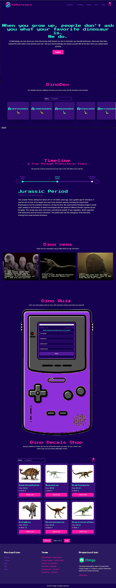

# DiNostalgia

# 🔗 [Live preview](https://dinostalgia.vercel.app/)
# ▶️ [Video walkthrough by dev](https://rumble.com/v6lxbbj-dinostalgia-app-walkthrough-voyage-53-team-33.html)

---

## Table of Contents

- [About Project](#about-project)
- [Features](#features)
- [How it works](#how-it-works)
- [Technologies & Dependencies used](#technologies--dependencies-used)
- [Prerequisites](#prerequisites)
- [Clone & Run locally](#clone--run-locally)
- [Team](#team)
- [Special Thanks](#special-thanks)
- [Contributing](#contributing)

---

## About Project

Dinostalgia is a platform that educates and entertains adults who love dinosaurs. This app will combine educational content, interactive features, and e-commerce functionality to provide a comprehensive and engaging experience for dinosaur enthusiasts. 

It is a full stack applications, using React as primary frontend language, and NodeJS/Express as primary backend language. Supabase is used for database. To learn more, visit *Technologies & Dependencies used* section further down or refer to readme file inside **backend**.

---

## Features

- **DinoDex:** A detailed database of various dinosaurs, complete with images, descriptions, and other relevant information. Users can search and filter dinosaurs by name, diet, and country of discovery.

- **Timeline:** An interactive timeline that provides a historical overview of the different periods when dinosaurs roamed the Earth, including the Triassic, Jurassic, and Cretaceous periods.

- **News:** A section dedicated to the latest news articles about dinosaurs, fetched from an external API, ensuring users stay updated with recent discoveries and research.

- **Quiz:** A fun and educational quiz that tests users' knowledge about dinosaurs, with questions ranging from dinosaur names to their characteristics and historical facts.

- **Ecommerce:** Small scale online shop where users can browse dinosaur-themed merchandise. The shop features a search options, filter options, and a shopping cart for managing purchases.  
  **Note:** users cannot actually **pay money** and purchase the items.

- **Shopping Cart and Checkout:** Shopping Cart that allows users to add, remove, and update the quantity of items. The checkout process includes user authentication and order management through Supabase.

---

## How it works

The DiNostalgia app is built using React for the frontend, with Redux Toolkit for state management and Supabase for backend services. Here's a detailed explanation of how each section works:

- **DinoDex:**

The DinoDex component fetches dinosaur data from an API and displays it in a searchable and filterable format.
Users can search for dinosaurs by name, diet, or country of discovery. The search functionality uses regular expressions to match any part of the dinosaur name.
Clicking on a dinosaur opens a detailed modal view with more information, including images, descriptions, and additional details.

- **Timeline:**

The Timeline component provides an interactive timeline of dinosaur history, highlighting key periods and events.
Users can navigate through the timeline using next and previous buttons, and click on specific events to view detailed descriptions.

- **News:**

The News component fetches the latest dinosaur-related news articles from an external API.
Articles are displayed in a responsive grid layout, with each article linking to the original source for more information.

- **Quiz:**

The Quiz component presents a series of multiple-choice questions about dinosaurs.
Users can answer questions, and their scores are calculated based on correct answers. The quiz includes a progress bar and displays the final score.

- **Ecommerce:**

The Ecommerce component displays dinosaur-themed merchandise. Users can search and filter products by name, diet, stock, and price. The search functionality ensures that products are filtered across all pages.
Each product card includes an image, name, price, stock status, and an "Add to Cart" button.

- **Shopping Cart and Checkout:**

The Shopping Cart component allows users to manage their selected items, including updating quantities and removing items.
The Checkout component handles user authentication through Supabase and processes orders. The app ensures that the cart state is saved in local storage, allowing users to resume their shopping session even after closing the browser.

---

## Technologies & Dependencies used

- **React:** for all the logic, many React features were used: conditionals, components, useState, useEffect, functions...

- **Redux Toolkit:** for global state management.

- **React Icons:** for all the icons in the app.

- **Framer motion:** for animations

- **React Router:** for all routing needs.

- **Tailwind:** for all styling, dark mode, custom classes...

- **Supabase:** for all authentication, and dinosaurs fetching from the database needs

 

**dependencies:**

- "@reduxjs/toolkit": "^2.5.0",
- "@supabase/auth-ui-react": "^0.4.7",
- "@supabase/auth-ui-shared": "^0.1.8",
- "@supabase/supabase-js": "^2.48.1",
- "framer-motion": "^11.17.0",
- "react": "^18.3.1",
- "react-dom": "^18.3.1",
- "react-icons": "^5.4.0",
- "react-redux": "^9.2.0",
- "react-router-dom": "^7.1.3",
- "react-toastify": "^11.0.3"

**devDependencies:**

- "@eslint/js": "^9.17.0",
- "@types/react": "^18.3.18",
- "@types/react-dom": "^18.3.5",
- "@vitejs/plugin-react": "^4.3.4",
- "autoprefixer": "^10.4.20",
- "eslint": "^9.17.0",
- "eslint-plugin-react": "^7.37.2",
- "eslint-plugin-react-hooks": "^5.0.0",
- "eslint-plugin-react-refresh": "^0.4.16",
- "globals": "^15.14.0",
- "postcss": "^8.4.49",
- "prettier": "^3.4.2",
- "prettier-plugin-tailwindcss": "^0.6.10",
- "tailwindcss": "^3.4.17",
- "vite": "^6.0.5"

---

## Prerequisites

Ensure you have the following installed on your system:

    Node.js v18.00.0
    npm or yarn

---

## Clone & Run locally

Notice: For running this app locally, you will need .env keys to connect to the APIs which only the dev team of this project has 

1. **Clone the Repository:**

   - On the GitHub repo page, click the green "Code" button.

   - Copy the HTTPS URL.

2. **Open the Terminal:**

   - Open the terminal by typing "cmd" in your desktop's start menu, **OR**

   - Right-click on the desktop and select "Git Bash Here" (if you have Git Bash installed), **OR**

   - Open Visual Studio Code's terminal by clicking "Terminal" -> "New Terminal" inside the editor.

3. **Navigate to Your Project Location:**

   - In the terminal, navigate to your desired location (e.g., desktop) using the command: `cd desktop`. Adjust the path if your project is located elsewhere.

   - Ensure that your terminal's address is inside the project folder.

4. **Clone the Repository:**

   - Run the command: `git clone /link/`. Replace `/link/` with the HTTPS URL from step 1.

5. **Enter the Project Directory:**

   - Navigate into the cloned repository by typing: `cd /folder-name/`. Replace `/folder-name/` with the name of the cloned folder.

6. **Install Dependencies:**

   - Run the command: `npm install` to install all the necessary dependencies.

7. **Start the Project:**

   - Run the command: `npm run dev` or `yarn dev` to start the project. You will need to manually open the browser address at [localhost:5173/](http://localhost:5173/)

---

## Team

Voyage 53 - team 33. January 2025

- Estelle Wraight - Product Owner: [GitHub](https://github.com/Escargotte) / [LinkedIn](https://www.linkedin.com/in/estelle-couture-41422b47/)

- Promise Akabudu - Product Owner: [GitHub](https://github.com/Pakabudu) / [LinkedIn](https://www.linkedin.com/in/promise-akabudu/)

- Afrah Ali - Scrum Master: [GitHub](https://github.com/afbaf) / [LinkedIn](https://www.linkedin.com/in/afrah-ali-251264269/)

- Dayo Abdul - Developer: [GitHub](https://github.com/Dayo1900)

- Predrag Jandric - Developer: [GitHub](https://github.com/Predrag-Jandric) / [LinkedIn](https://www.linkedin.com/in/predrag-jandric/)

- Greg Minezzi - Developer: [GitHub](https://github.com/minezzig) / [LinkedIn](https://www.linkedin.com/in/gregminezzi)

---

### Special Thanks

We as a whole team would like to thank Chingu platform and community for this opportunity to learn, improve and collaborate. Thank you Chingu !

Chingu is a platform that helps developers and other people in tech related roles practice in-demand skills and accelerate their learning through collaboration and project-building.

Learn more about Chingu platform at https://www.chingu.io/

---

## Contributing

Contributions to this project are closed.
